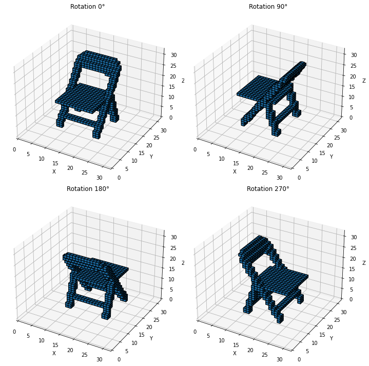
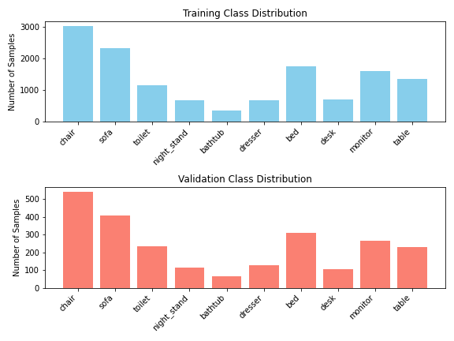
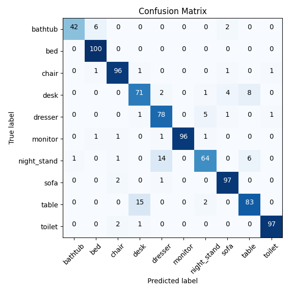
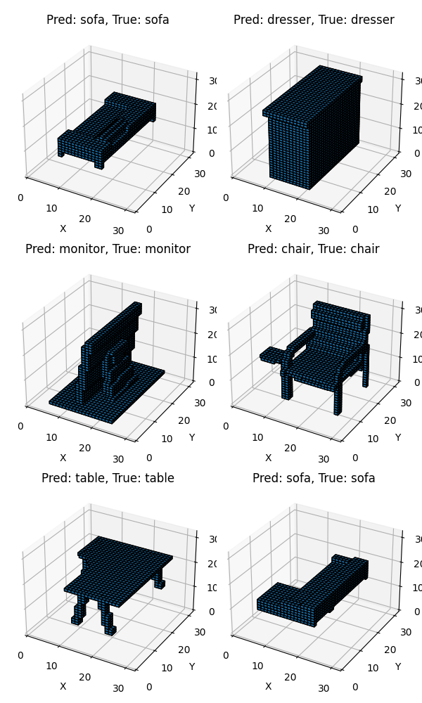

## Overview
This project focuses on classifying 3D shapes from the ModelNet10 dataset using deep learning, specifically 3D Convolutional Neural Networks (3D CNNs). ModelNet10 is a well-known benchmark dataset for 3D object recognition tasks, consisting of CAD models from 10 object categories.

The primary goal is to demonstrate the effectiveness of 3D CNNs in capturing spatial features from voxelized representations of these models, enabling accurate classification across various object types.

## Dataset
The ModelNet10 dataset can be downloaded [here](http://3dvision.princeton.edu/projects/2014/3DShapeNets/ModelNet10.zip). The dataset consists of 10 categories:
- Bathtub
- Bed
- Chair
- Desk
- Dresser
- Monitor
- Nightstand
- Sofa
- Table
- Toilet

Each object is provided as a 3D CAD model in the `.off` file format. The dataset is split into training and test sets, where each model is stored in its corresponding class folder.

### Dataset Conversion
To utilize the dataset in a format suitable for 3D CNNs, the CAD models in `.off` format are converted into voxel grids, namely, 3D arrays where each element represents a spatial "voxel" (volume pixel), capturing the structure of the object.

Run the `preprocessing.py` script to convert the `.off` models to voxel grids. The script generates a dataset named `ModelNet10Voxel_{grid_size}_{object_size}_{pitch_rescale}_{no_of_rotations}`, where each object is stored as a `.pt` file. The voxelized dataset follows the same folder structure as the original ModelNet10.

### Customization
By default, the script above will be run with the following parameters:
- `grid_size = 32`
- `object_size = 28`
- `pitch_rescale = 1`
- `no_of_rotations = 4`

but the user is free to experiment with other resolutions and a different number of rotated copies. 

The training and validation datasets have quite an unbalanced class distribution

## Approach
The Simple3DCNN is a 3D convolutional neural network designed to classify 3D voxel grids into 10 categories.
- Input: 32x32x32 voxel grid with 1 channel.
- Conv3D Layers: Three convolutional layers progressively extract spatial features using 16, 32, and 64 filters with 3x3x3 kernels. Each layer is followed by ReLU activation and 2x2x2 max pooling to reduce spatial dimensions.
- Fully Connected Layers: After flattening the feature maps, a 64-unit fully connected layer is applied, followed by dropout (p=0.2) to prevent overfitting. The final layer outputs class predictions for the 10 categories.

### Training
For training the model, run the `train.py` script. Here you can set `resume_training` to `True` in case you need to train in different time windows.

### Optimization
The model is trained using Adam optimizer, which is known for its efficiency in training deep neural networks. The loss function used is cross-entropy loss, commonly used for classification tasks.

### Training parameters
- Batch Size: 64
- Learning Rate: 1e-4 (tuned to ensure stable convergence).
- Epochs: 50 (with early stopping).
- Early Stopping: If the validation loss does not improve for 5 consecutive epochs, training is halted to prevent overfitting and save resources.

These can be changed by passing them as arguments to `train.py`. 

## Results and Evaluation
The model is evaluated using standard metrics such as accuracy, precision, recall, and F1-score. Additionally, confusion matrices are generated to provide insight into which classes are most frequently misclassified.

With only 333k parameters, this model achieves an accuracy score of 90.7%, and a top-2 accuracy of 96.6%.
.

.

The user can run `evaluate.py` for testing the model in the repo, or any other model obtained by a separate training.

## Contributors

- [Marco Calì](https://github.com/MarcoCali0)

## Contact

For questions or issues, feel free to contact me:

- Email: marcocali@protonmail.com
- GitHub: [@MarcoCali0](https://github.com/MarcoCali0)

## Acknowledgments
This project was developed as an assignment for the course Neural Networks and Deep Learning at the University of Padua, held by Prof. Pegoraro in the academic year 2023/2024.

Special thanks to [ModelNet Dataset creators](http://3dvision.princeton.edu/projects/2014/3DShapeNets/) for the dataset. 

## License
This project is licensed under the MIT License.

Thanks for checking out this project!  
*Marco Calì*

